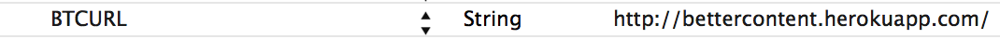

# BetterContent

## Usage

To run the example project, clone the repo, and run `pod install` from the Example directory first.

## Requirements

## Installation

BetterContent is available through [CocoaPods](http://cocoapods.org). To install
it, simply add the following line to your Podfile:

    pod "BetterContent"

## Configuration

BetterContent will try to access a websocket server on ws://localhost:5000 by default. In order to customize the url, add a custom key named `BTCURL` (of type `String`) to your \{app\}-info.plist.

## TODO

 - Read settings (server url) from some plist
 - Labels - only set labels that haven't changed

## Author

gardenofwine, gardenofwine@gmail.com

## License

BetterContent is available under the GPL license. See the LICENSE file for more info.
